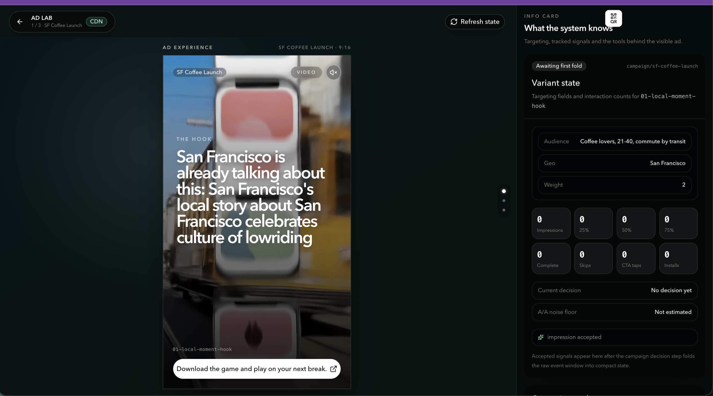
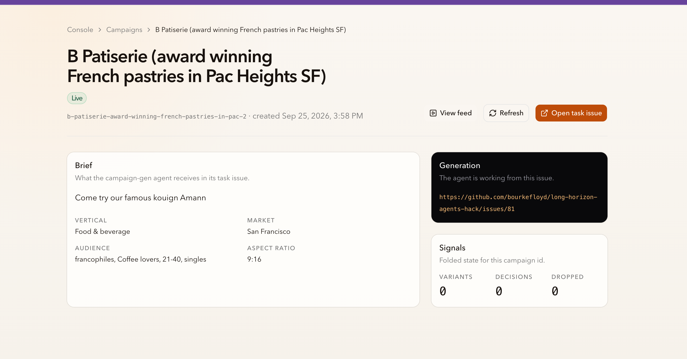
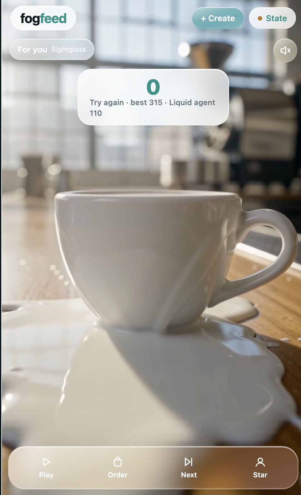
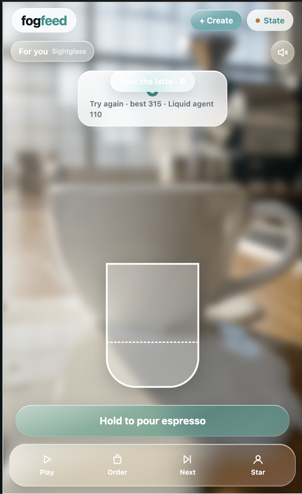
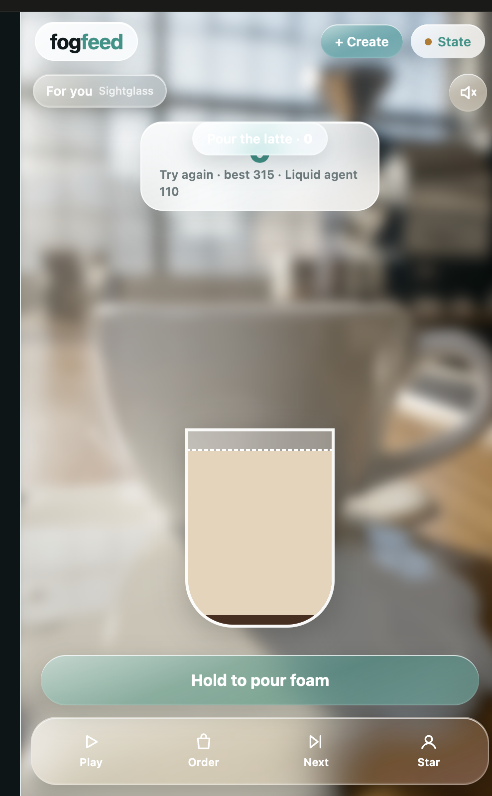

# Local Ad Platform
### 🏆 1st place — Best use of Nimble · Horizon Agents Hack 🏆

**Local vertical video ads** for the [Horizon Agents Hack](https://luma.com/horizonagentshack). Winners slide name: Local Ad Platform.

*In person, San Francisco Financial District. Friday 25 September 2026, 9:30 AM–7:30 PM PT. Awards at 7:00 PM. Hosts: tokens& and AWS Builder Loft.*

> [!NOTE]
> **Built on site.** This repository was designed and implemented entirely on site that day by the team.

**1st place, Best use of Nimble.** Prize: $1,500, 5,000 Search credits, and 100 agent-run credits.

*SF Coffee Launch, 9:16, in the ad feed.*

## Team

- **[Thomas Barrios](https://www.linkedin.com/in/tbarrios2/)** ([X](https://x.com/tbarrios2)) — marketing schema, Nimble, campaign generation.
- **[Aayush Srivastava](https://www.linkedin.com/in/aayushsrivastava/)** ([X](https://x.com/aayush_agi)) — content generation (BFL FLUX, Liquid).
- **[Bourke Floyd](https://www.linkedin.com/in/bourkefloyd/)** ([X](https://x.com/bourkefloyd)) — long-horizon infrastructure (GitHub Actions agents, web, Cloud Run, CDN).

## Product

Local vertical 9:16 video ad campaigns. Nimble discovery, scripts, FLUX.2 pro posters at 1088×1920, FLUX 3 video at 9:16 hd, a public GCS CDN, a swipe feed, and a way to queue the next campaign from the site. Campaign memory is one compact mutable state. There is no on-device LLM in the ad.

## Architecture

**Long-horizon SWE.** Issues labeled `lh:web` and `lh:campaign-gen` wake a restricted Cursor CLI agent. It updates a capped state file and opens a pull request. `/approve` squash-merges. See [docs/LH_WORKFLOWS.md](docs/LH_WORKFLOWS.md).

**Local ad marketing.** Nimble → script schema → Black Forest Labs image and video → a public GCS manifest → a Next.js feed on Cloud Run `lh-web`. FastAPI `lh-campaign-service` stores campaign JSON in GCS. A QR code points at `/campaigns/new`.

**Not on the live path.** Tinybird was intended as agent-event memory and was never validated. Liquid was a paused local llama.cpp experiment, not the live path.

```mermaid
flowchart TD
    subgraph SWE["Long-horizon SWE"]
        Issue["Issue labeled lh:web or lh:campaign-gen"]
        Agent["Restricted Cursor CLI agent"]
        State["Capped state file"]
        PR["Pull request"]
        Approve["/approve squash-merges"]
        Issue --> Agent --> State --> PR --> Approve
    end

    subgraph Ads["Local ad marketing"]
        Nimble["Nimble discovery"]
        Script["Script schema"]
        BFL["BFL FLUX.2 pro posters 1088×1920<br/>FLUX 3 video 9:16 hd"]
        Manifest["Public GCS manifest"]
        Web["Next.js swipe feed<br/>Cloud Run lh-web"]
        API["FastAPI lh-campaign-service"]
        CampaignJSON["Campaign JSON in GCS"]
        QR["QR to /campaigns/new"]
        Nimble --> Script --> BFL --> Manifest --> Web
        QR --> Web
        Web -->|"queue next campaign"| API
        API --> CampaignJSON
    end
```

## Screenshots

*Campaign page for B Patisserie. Brief, market, 9:16, and the folded signal counts.*

  
  
  

*Fog Feed, Sightglass. Pour the latte. The card shows a Liquid agent score.*

## Layout

| Path | What it is |
| --- | --- |
| [HACK_PLAN.md](HACK_PLAN.md) | Day plan |
| [web/](web/) | Next.js feed and campaign pages |
| [service/](service/) | FastAPI campaign service |
| [viral-local-ad-generator/](viral-local-ad-generator/) | Nimble discovery, scripts, and staging |
| [cdn/](cdn/) | Manifest contract and staged creatives |
| [docs/cdn.md](docs/cdn.md) | GCS CDN |
| [.lh/](.lh/) | Capped long-horizon state |
