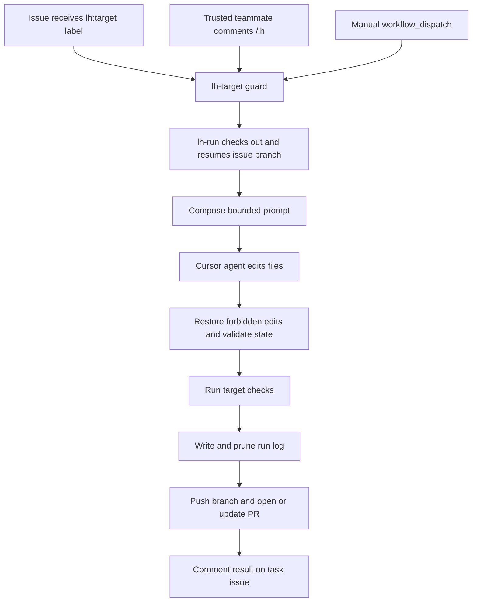
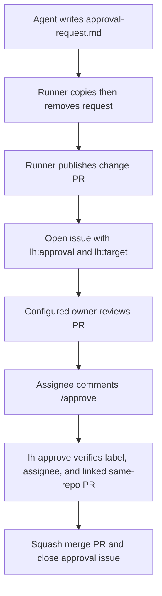
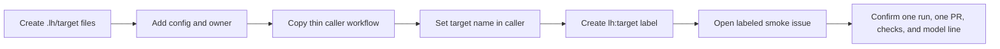

# Long Horizon workflows

The Long Horizon (LH) system lets a Cursor agent keep working across GitHub Actions runs without carrying an ever-growing transcript. Each target keeps one compact mutable state file. Every run drops stale context, runs deterministic checks, and publishes an auditable branch and pull request. Git remains the complete history.

## The idea

An agent gets only the context it needs now: its target prompt, current issue, current state, one-shot instruction, and the newest run logs. It rewrites state rather than appending history. Important conclusions survive in `Decisions`; intentionally forgotten details go in `Dropped`. Older logs are pruned from the working tree but remain available in git history.

This gives the campaign project continuity without context rot:

- bounded working memory instead of a growing transcript;
- deterministic checks and state validation outside the model;
- reviewable self-improvement because prompt changes take effect only after merge;
- complete audit history in issues, workflow runs, commits, and pull requests.

## Pieces

### Targets and callers

Each target has `.lh/<target>/prompt.md`, `state.md`, `checks.sh`, and an optional `config.json` model override.

- `web` maintains the operator-facing Next.js campaign console. Its label is `lh:web`, caller is `lh-web.yml`, and configured model is `grok-4.7-high`.
- `campaign-gen` is Thomas's campaign generator: Nimble research → scripts → BFL briefs. Its label is `lh:campaign-gen`, caller is `lh-campaign-gen.yml`, and configured model is `claude-fable-5-1-thinking-high`.

Nimble is a tool used by `campaign-gen`, not a target name. The application directory remains `viral-local-ad-generator/`.

The thin caller declares `issues.labeled`, `issue_comment`, and `workflow_dispatch`, then delegates to `.github/workflows/lh-target.yml`.

### Router and reusable runner

`lh-target.yml` accepts the target, optional issue number, one-shot instruction, and optional model override. Its guard starts work only when:

- the exact `lh:<target>` label was added to a normal issue;
- an OWNER, MEMBER, or COLLABORATOR comments `/lh` on a labeled normal issue; or
- a teammate starts `workflow_dispatch`.

`lh-run.yml` performs the work. It validates inputs, checks out without persisted credentials, resumes or creates the issue branch, composes the prompt, invokes the Cursor CLI, validates state, runs target checks, writes a short log, pushes, and opens or updates a PR.

### Bounded state contract

Every `state.md` has exactly these H2 sections in this order:

1. `Goal`
2. `Current plan`
3. `Done`
4. `Open`
5. `Decisions`
6. `Dropped`

The default cap is 80 lines, with at most 200 characters per line. `.lh/bin/check-state.sh` enforces the contract before and after the agent runs. If the rewrite is invalid, the runner restores the previous state and records the rejection.

`.lh/bin/compose-prompt.sh` supplies only `prompt.md`, `state.md`, the current issue, the `/lh` or dispatch instruction, the hard rules, and up to five recent logs. `.lh/bin/prune-logs.sh` keeps the newest five `.lh/log/<run-id>.md` files by default.

### Prompts, checks, permissions, and owners

`prompt.md` defines what good work means for a target. An agent may improve its own prompt, but that edit rides in the PR and cannot affect another run until merged.

`checks.sh` is run by the workflow after the agent step and cannot be skipped by the agent. Failed checks still publish the branch and PR so a follow-up run can repair them, then the job fails.

`.cursor/cli.json` allows file reads/writes and a short command list while denying git, GitHub CLI, destructive/network shells, credentials, and edits to workflow, Cursor, helper, log, and environment files. The workflow also deterministically discards edits under `.github/` and `.cursor/`.

`.lh/owners.json` maps targets to GitHub assignees for approval issues. `campaign-gen` approvals go to
[`tbarrios`](https://github.com/tbarrios); missing owners fall back to `default`.

### Model selection

Model precedence is:

1. a non-empty `workflow_dispatch` `model` input;
2. `.lh/<target>/config.json` `model`;
3. the default `grok-4.7-high`.

Normal work uses Grok 4.7 High. The multi-step `campaign-gen` research workflow opts into Fable 5.1 Thinking High. The runner prints the chosen slug in the agent initialization line, run log, job summary, commit message, PR body, and issue comment. `agent models` runs before agent initialization; an unavailable slug fails visibly instead of silently changing model families.

## Task to pull request

Issue work uses `lh/<target>/issue-<number>`. A manual run uses `lh/<target>/manual-<run-id>`. If the issue branch already exists, the runner resumes it so state continues before merge. The workflow refuses to push to `main`.

## Human approval

Changes that spend money, change the marketing schema, or publish content require an explicit gate. The agent proposes the real change and writes `.lh/<target>/approval-request.md`; its first non-empty line is a non-secret summary.

The request body is intentionally not copied into the issue. `lh-approve.yml` accepts `/approve` only from an assignee of an `lh:approval` issue and only merges the same-repository PR linked in that issue.

## Using LH

### Give an agent a task

1. Open one reviewable issue.
2. Add exactly the target label, such as `lh:campaign-gen`.
3. Follow the linked Actions run and review the PR posted back to the issue.
4. Merge normally, or use the approval issue when the agent requests a human decision.

Creating an issue with the label attached still produces the `issues.labeled` event used by the router.

### Follow up

Comment `/lh <instruction>` on the same labeled issue. The caller ignores `/lh` on PR threads and comments from users who are not repository owners, members, or collaborators. A follow-up resumes the existing issue branch and updates its PR.

### Re-run manually

Open Actions, select `LH web` or `LH campaign-gen`, and choose **Run workflow**. Use issue number `0` for an independent manual branch. Supply an issue number to reuse issue context. Leave `model` blank for target configuration, or provide a slug to override it for that dispatch.

### Approve

Review the linked PR, then comment `/approve` on the approval issue—not on the task issue or PR. You must be assigned to the approval issue.

## Add a target

1. Add `.lh/<target>/prompt.md`, `state.md`, and executable `checks.sh`; add `config.json` when overriding Grok 4.7 High.
2. Add the target owner to `.lh/owners.json`.
3. Copy a thin caller such as `lh-campaign-gen.yml`, rename it, and set `target`.
4. Create the `lh:<target>` label.
5. Smoke with a labeled issue and a state-only instruction.

No allowlist change is needed in the shared runner: safe lowercase target names with internal hyphens are accepted.

## How LH connects to the product

LH develops the repository; separate workflows operate the product:

- `deploy-cloud-run.yml` builds `service/`, pushes to Artifact Registry, and deploys the FastAPI campaign service to Cloud Run.
- `deploy-web.yml` builds `web/` with API and ad-manifest URLs, then deploys the Next.js console to Cloud Run.
- `publish-assets.yml` turns `cdn/staging/<campaign>/<variant>/` into hashed public GCS assets and updates `manifest.json`.
- `tag-demo.yml` pins the `demo` traffic tag to a chosen or latest ready API/web revision without moving `LATEST`.

The service folds raw signals into compact campaign state and drops stale events at decision time, mirroring LH's bounded-memory design. See [Cloud Run](cloud-run.md) and [CDN](cdn.md).

## Operations

### Required GitHub configuration

LH secrets:

- `CURSOR_API_KEY` — required by every agent run.
- `NIMBLE_API_KEY` — optional and exposed only to `campaign-gen` and its checks.

Other repository secrets used by connected workflows:

- `BFL_API_KEY` — content generation.
- `GCP_SA_KEY` — optional Google Cloud authentication fallback; Workload Identity Federation is preferred.

Repository variables used by deploy and publish workflows:

- `GCP_PROJECT_ID`, `GCP_REGION`
- `GCP_WORKLOAD_IDENTITY_PROVIDER`, `GCP_SERVICE_ACCOUNT`
- `CLOUD_RUN_RUNTIME_SERVICE_ACCOUNT`
- `ARTIFACT_REGISTRY_REPOSITORY`
- `CLOUD_RUN_SERVICE`, `CLOUD_RUN_WEB_SERVICE`
- `CLOUD_RUN_PUBLIC` (optional; `false` requires authenticated API invocation)
- `API_BASE_URL`
- `ADS_BUCKET`, `ADS_MANIFEST_URL`

The repository setting **Allow GitHub Actions to create and approve pull requests** must be enabled. Otherwise LH publishes its branch but can only return a compare link.

Current labels are `lh:web`, `lh:campaign-gen`, and `lh:approval`. The retired `lh:nimble` label remains on historical closed issues but no workflow routes it.

### Concurrency and triggers

Only `lh-run.yml` owns concurrency, with group `lh-<target>-<issue>` and `cancel-in-progress: false`. Runs for the same target and issue queue; different issues or targets can proceed independently. Keeping concurrency out of nested caller/reusable workflows avoids the deadlock encountered when both levels competed for a group.

Target callers listen only for `issues.labeled`, not `issues.opened`. GitHub emits both when an issue is created with a label; routing only the label event prevents the duplicate runs seen with the original opened-plus-labeled setup.

Issue and comment triggers use workflow definitions from the default branch. Manual dispatch can target another ref that already contains the workflow.

### Common failures and fixes

- **Run never reaches the agent:** nested concurrency previously blocked the reusable job. Keep the concurrency group only in `lh-run.yml`.
- **Two runs for one new issue:** listening to both `issues.opened` and `issues.labeled` double-triggered labeled-at-create issues. Keep callers labeled-only.
- **Cursor exits before the prompt:** a top-level `version` key in `.cursor/cli.json` failed schema validation. The current file intentionally has only `permissions`.
- **Model rejected:** inspect the authenticated `agent models` output, update the exact slug in target config or dispatch input, and rerun. Do not use `auto` to hide the mismatch.
- **Cloud Run returns 403:** the demo API originally required authentication. The deploy now adds `--allow-unauthenticated` unless `CLOUD_RUN_PUBLIC=false`; the service also enables browser CORS. Redeploy after correcting that variable.
- **Deploy has empty Google Cloud values:** populate the listed repository variables and either both WIF values or the `GCP_SA_KEY` fallback.
- **PR creation fails:** enable the Actions pull-request setting; the branch is still pushed and the run returns a compare URL.

## Worked example: research, approval, merge

Historical issue [#19](https://github.com/bourkefloyd/long-horizon-agents-hack/issues/19) exercised the predecessor `nimble` target, now `campaign-gen`. The issue asked the agent to inspect `viral-local-ad-generator/`, rewrite its bounded state, and request approval for one live Nimble search without changing product code.

Run `36185817092` used the target prompt and state, passed deterministic checks, and opened [PR #20](https://github.com/bourkefloyd/long-horizon-agents-hack/pull/20). The temporary approval request caused [issue #21](https://github.com/bourkefloyd/long-horizon-agents-hack/issues/21) to open with the target and approval labels. The assigned owner commented `/approve`; `lh-approve.yml` verified the gate, squash-merged PR #20, and closed the approval issue.

Later, [issue #26](https://github.com/bourkefloyd/long-horizon-agents-hack/issues/26) asked for one scoped router-guard state update. One labeled event produced run `36187015708` and [PR #28](https://github.com/bourkefloyd/long-horizon-agents-hack/pull/28), confirming the labeled-only route and target-scoped edit.
