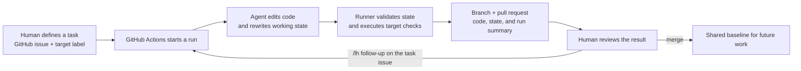
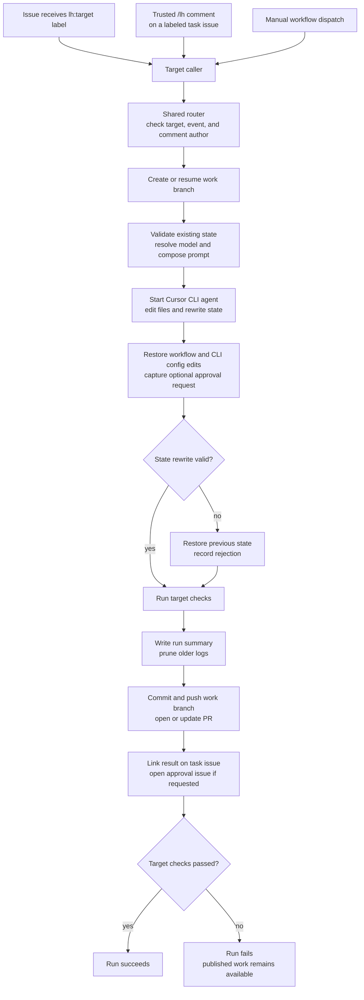
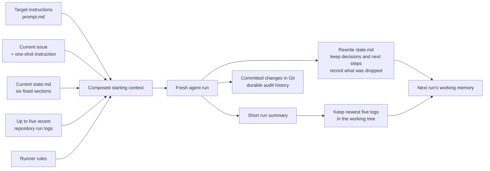
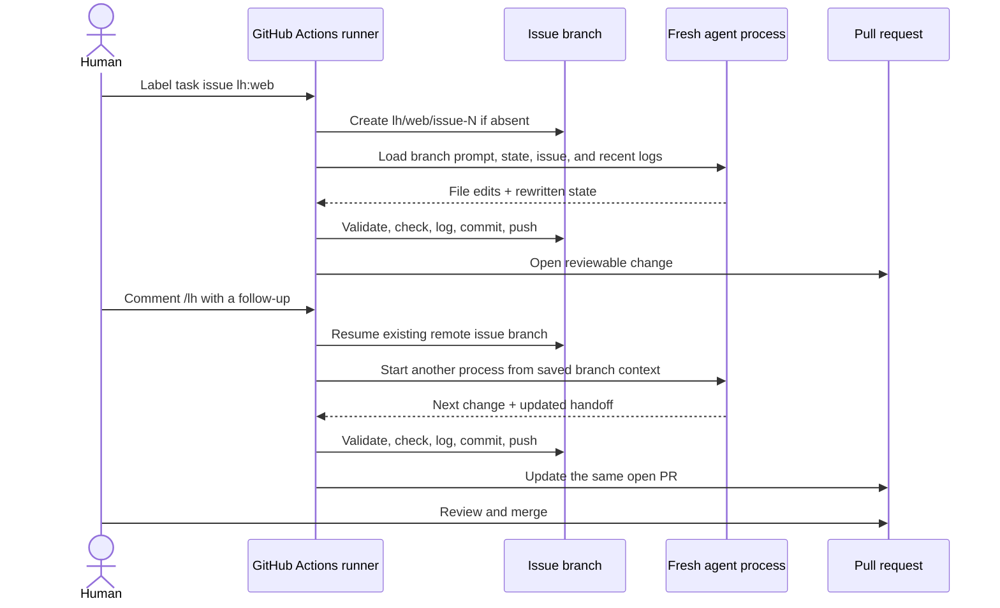
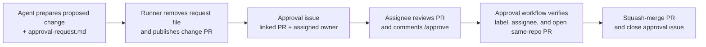
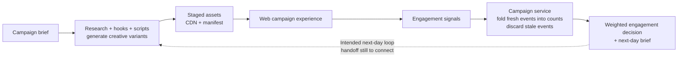

# Long Horizon Agent workflow

Presentation working draft · 25 September 2026

Based on the presentation plan and workflow notes on local `main`, checked against the implementation at `229bf60554a9e561e8b10efc77fc6aa46297dc36`. This is a narrative and diagram source for the presentation; the [operating guide][guide] contains setup and troubleshooting details.

## The story in one sentence

**An agent can keep working across separate runs by rewriting a small, explicit working state, retaining useful decisions, and dropping stale context while Git preserves the history.**

The unit of progress is a reviewable change. Each run starts a fresh agent process, loads the current task and working state, makes a focused change, and leaves a compact handoff for the next run.

> Presenter line: “The process ends. The useful state survives. The next run continues from that state.”

## 1. One task, repeated runs

The workflow is **event driven**. A target label, a trusted `/lh` comment, or a manual dispatch starts another run. There is no timer or automatic “keep going until done” loop in the LH runner. Long-horizon continuity comes from saved state and branch reuse across those runs.

Two targets exist in this snapshot:

| Target | Task label | Scope |
| --- | --- | --- |
| `web` | `lh:web` | Next.js campaign console, API states, and visibility into campaign decisions. |
| `campaign-gen` | `lh:campaign-gen` | Campaign generator: local research, hooks, scripts, and generation briefs. Nimble is a tool used by this target. |

Each target has its own `prompt.md`, `state.md`, `checks.sh`, and optional model configuration under `.lh/<target>/`. Thin target workflows share the same router and runner.

## 2. What happens inside one run

The routing layer accepts `/lh` only from repository owners, members, or collaborators on normal issues with the matching target label. Label triggers use `issues.labeled`; avoiding an additional `issues.opened` trigger prevents duplicate work when an issue is created with its label already attached.

The model edits files. Deterministic workflow steps handle branch creation, validation, logging, pushing, PR updates, and issue comments. The `web` checks install dependencies, lint, and build; `campaign-gen` checks compile Python and validate a mock campaign run offline.

Checks that fail still lead to a published branch and PR, followed by a failed job. An invalid state rewrite is restored and reported separately; it does not itself fail the final job. An already-invalid starting state or an agent process failure stops the run earlier, before this publication path.

Source: [runner][runner], [router][router], and [target checks][checks].

## 3. Memory: keep the decision, drop the history from the handoff

The state contract is concrete: **six H2 sections in order, at most 80 lines by default, and no line longer than 200 characters**. The agent rewrites the file each run. A script validates the structure and rejects a log/history section.

| State section | What survives into the next run |
| --- | --- |
| `Goal` | What the target is trying to accomplish. |
| `Current plan` | The next useful steps, ordered by priority. |
| `Done` | Compressed outcomes that still matter. |
| `Open` | Blockers, unanswered questions, and human decisions needed. |
| `Decisions` | Choices and their reasons, so the next run does not repeat the same reasoning. |
| `Dropped` | What was removed from working state and why it is safe to forget. |

The prompt composer also limits the current issue to 12,000 bytes, the one-shot instruction to 4,000 bytes, and each included log to 3,000 bytes. It includes at most five logs by default, selected from the repository-wide `.lh/log/` directory. After a run writes its summary, pruning keeps the newest five logs in that checkout. Older committed logs remain in Git history.

These limits bound the state and recent-history inputs. They are not a hard token cap on everything the agent can read: target prompt length is not enforced by the composer, and the agent can inspect repository files while working. The validator checks state shape; the model and reviewer still judge whether its contents are useful and accurate.

An existing example makes “Dropped” tangible: the `web` state records that logs from other targets do not change the current web work. The run retains that conclusion without copying those logs into permanent working state.

> Presenter line: “Working memory answers what matters next. Git answers how we got here.”

Source: [prompt composition][composer], [state validation][validator], [log pruning][pruner], and [example web state][web-state].

## 4. How the next run continues before a merge

Issue work uses `lh/<target>/issue-<number>`. A manual run without an issue uses `lh/<target>/manual-<run-id>`. The runner resumes an existing remote issue branch, allowing unfinished work and state to carry forward before review is complete. A merge makes that work part of the base for subsequent tasks.

The runner owns one concurrency group per target and issue, with cancellation disabled. Different targets or issues can run independently. Their state updates meet through Git and PR review; there is no separate mechanism that reconciles the meaning of competing state edits.

Agents may propose changes to their own `prompt.md` and record the reason in `Decisions`. Those edits are reviewable in the PR. **A follow-up that resumes the same issue branch reads that branch's edited prompt even before merge.** The older notes describe prompt changes as merge-only; the current runner does not enforce that boundary. Merge establishes the instructions for new work starting from the shared base.

## 5. Human decisions are part of the workflow

The `campaign-gen` prompt requires a human decision before spending money, changing its marketing output schema, or publishing content. The agent prepares a proposed change and writes a temporary approval request. The runner turns that request into a linked GitHub issue.

The approval request file is removed before commit. Its first non-empty line supplies the issue summary; the full request body is not copied into the issue. `/approve` belongs on the approval issue and is accepted only from an assignee.

This path approves and merges the proposed change. It does not automatically execute a requested paid API call afterward, and the approval workflow has no additional explicit check-result gate beyond what GitHub permits at merge time. Reviewers inspect the PR and run results before approval.

The agent step receives its model credential and, for `campaign-gen`, the Nimble credential. Checkout does not persist Git credentials, and the runner supplies its GitHub token to publication steps. CLI permissions deny selected commands and protected paths; the runner additionally restores edits under `.github/` and `.cursor/`. These controls separate agent edits from publication, but they should not be presented as complete isolation of arbitrary code execution.

Source: [campaign target instructions][campaign-prompt], [approval workflow][approval], and [CLI permissions][permissions].

## 6. Connect the agent platform to the campaign demo

The [hack plan][plan] applies the same “keep useful state, drop stale details” principle to video ad campaigns. LH builds and maintains the repository. Separate application code and workflows operate the campaign product.

In this snapshot, the service drains its raw-event buffer at decision time, folds fresh events into per-variant counts, counts stale events as dropped, retains the latest 30 decisions, and returns a next-day creative brief. The current store is in memory. The decision rule is a weighted engagement score; `aa_noise_floor` remains `not_estimated`.

The separate content-generation workflow can generate assets, create and merge its content PR, and dispatch CDN publication. Its entry point is manual dispatch. The service's next-day brief is not automatically wired into that workflow here.

For the presentation, describe the A/A-calibrated, day-over-day generation loop as the intended product experience. Label simulated signals clearly. The checked-in implementation does not establish measured lift, durable campaign memory across service restarts, or a fully connected autonomous daily loop. The campaign state's variant list and counts can also grow as variants are added; only its decision history has the explicit 30-entry cap.

Source: [campaign service logic][logic], [campaign models][models], [storage][store], and [content-generation workflow][generation].

## 7. Suggested presentation walkthrough

| Beat | Show | Say |
| --- | --- | --- |
| Problem | One-task diagram | “Repeated work needs a reliable handoff between runs.” |
| Memory | `state.md` and the memory diagram | “Six sections capture what matters next, including what we deliberately dropped.” |
| Execution | A task issue, Actions result, and PR | “The agent makes the change; the runner checks it and records the result.” |
| Continuity | A follow-up on the same issue branch | “A fresh process continues from saved state without replaying the full conversation.” |
| Human decision | Approval diagram | “A proposed consequential change comes back to an assigned human for review.” |
| Product | Campaign diagram and kept/dropped state | “We apply the same principle to the campaign's working memory.” |

A concrete checked-in example is [run 36192176868][example-run] for task issue #42. Its log records successful checks, a valid 37-line web state, a state-only change, and the decision to drop irrelevant other-target logs. Use it as evidence of routing, state validation, and an auditable handoff. It is a smoke test, not evidence of days-long reliability or improved campaign performance.

Before presenting a live continuation, choose a task with an open PR branch, show its current `state.md`, then use `/lh <one focused follow-up>` and inspect the updated PR. The runner allows up to 30 minutes per run, so use a completed run for a short presentation unless a live run has already finished.

### Questions this draft should help answer

- **Where is memory?** In the target's rewritten `state.md`, with recent run summaries and repository files available for context.
- **What is forgotten?** Stale state details and older logs leave the active handoff; committed history remains recoverable in Git.
- **What makes it long horizon?** Work survives separate processes and repeated task events through explicit state and branch continuity.
- **What makes it reviewable?** Code, state, prompt changes, check results, and run summaries are linked through a PR and task issue.
- **What remains to demonstrate?** Repeated continuation over a longer task and the fully connected campaign feedback loop.

## Source snapshot

Links below are pinned to the local `main` commit used for this draft so later repository changes do not silently change its evidence. Implementation takes precedence where older notes differ.

- [Presentation plan][plan] and [existing workflow notes][guide].
- [Reusable runner][runner], [router][router], and [approval handler][approval].
- [Prompt composer][composer], [state validator][validator], and [log pruner][pruner].
- [Web state example][web-state] and [recorded run][example-run].

[plan]: https://github.com/bourkefloyd/long-horizon-agents-hack/blob/229bf60554a9e561e8b10efc77fc6aa46297dc36/HACK_PLAN.md
[guide]: https://github.com/bourkefloyd/long-horizon-agents-hack/blob/229bf60554a9e561e8b10efc77fc6aa46297dc36/docs/LH_WORKFLOWS.md
[runner]: https://github.com/bourkefloyd/long-horizon-agents-hack/blob/229bf60554a9e561e8b10efc77fc6aa46297dc36/.github/workflows/lh-run.yml
[router]: https://github.com/bourkefloyd/long-horizon-agents-hack/blob/229bf60554a9e561e8b10efc77fc6aa46297dc36/.github/workflows/lh-target.yml
[checks]: https://github.com/bourkefloyd/long-horizon-agents-hack/tree/229bf60554a9e561e8b10efc77fc6aa46297dc36/.lh
[composer]: https://github.com/bourkefloyd/long-horizon-agents-hack/blob/229bf60554a9e561e8b10efc77fc6aa46297dc36/.lh/bin/compose-prompt.sh
[validator]: https://github.com/bourkefloyd/long-horizon-agents-hack/blob/229bf60554a9e561e8b10efc77fc6aa46297dc36/.lh/bin/check-state.sh
[pruner]: https://github.com/bourkefloyd/long-horizon-agents-hack/blob/229bf60554a9e561e8b10efc77fc6aa46297dc36/.lh/bin/prune-logs.sh
[web-state]: https://github.com/bourkefloyd/long-horizon-agents-hack/blob/229bf60554a9e561e8b10efc77fc6aa46297dc36/.lh/web/state.md
[campaign-prompt]: https://github.com/bourkefloyd/long-horizon-agents-hack/blob/229bf60554a9e561e8b10efc77fc6aa46297dc36/.lh/campaign-gen/prompt.md
[approval]: https://github.com/bourkefloyd/long-horizon-agents-hack/blob/229bf60554a9e561e8b10efc77fc6aa46297dc36/.github/workflows/lh-approve.yml
[permissions]: https://github.com/bourkefloyd/long-horizon-agents-hack/blob/229bf60554a9e561e8b10efc77fc6aa46297dc36/.cursor/cli.json
[logic]: https://github.com/bourkefloyd/long-horizon-agents-hack/blob/229bf60554a9e561e8b10efc77fc6aa46297dc36/service/app/logic.py
[models]: https://github.com/bourkefloyd/long-horizon-agents-hack/blob/229bf60554a9e561e8b10efc77fc6aa46297dc36/service/app/models.py
[store]: https://github.com/bourkefloyd/long-horizon-agents-hack/blob/229bf60554a9e561e8b10efc77fc6aa46297dc36/service/app/store.py
[generation]: https://github.com/bourkefloyd/long-horizon-agents-hack/blob/229bf60554a9e561e8b10efc77fc6aa46297dc36/.github/workflows/generate-content.yml
[example-run]: https://github.com/bourkefloyd/long-horizon-agents-hack/blob/229bf60554a9e561e8b10efc77fc6aa46297dc36/.lh/log/36192176868.md
